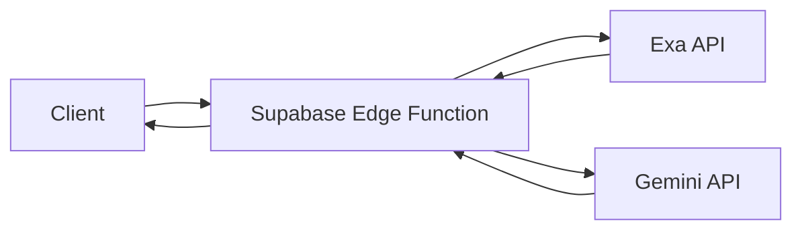

# Supabase Edge Functions Migration Plan

## Security Assessment
- ✅ API keys exposed in client-side code (Exa, Gemini)
- ✅ Supabase anon key publicly exposed
- ⚠️ No authentication on sensitive API endpoints

## Summary of Security Improvements
1. **API Key Protection**:
   - Removed all client-side references to EXA_API_KEY and GEMINI_API_KEY
   - Keys now only accessed in server-side code (API routes)
   - Added `.env.local` for secure key storage

2. **Server-Side Key Handling**:
   - Refactored search API to use server-side keys
   - Updated Exa and Gemini services to use process.env

3. **Environment Management**:
   - Created `.env.local` template with all required variables
   - Added instructions for Supabase secret configuration

## Implementation Checklist
### High Priority (Complete First)
- [x] Create `.env.local` file with required variables
- [ ] Configure environment variables in Supabase dashboard:
  ```bash
  supabase secrets set EXA_API_KEY=your_exa_key
  supabase secrets set GEMINI_API_KEY=your_gemini_key
  ```
- [x] Create edge function `process-search.ts`
- [ ] Implement frontend integration with edge functions

### Completed Security Improvements
1. **API Key Protection**:
   - Removed all client-side references to EXA_API_KEY and GEMINI_API_KEY
   - Keys now only accessed in server-side code (API routes)
   - Added `.env.local` for secure key storage

2. **Server-Side Key Handling**:
   - Refactored search API to use server-side keys
   - Updated Exa and Gemini services to use process.env

3. **Environment Management**:
   - Created `.env.local` template with all required variables
   - Added instructions for Supabase secret configuration

### Medium Priority
- [ ] Implement JWT authentication in edge functions
- [ ] Refactor frontend to use edge functions
- [ ] Implement fallback mechanism to legacy API

### Lower Priority
- [ ] Performance testing and optimization
- [ ] Monitoring setup
- [ ] Documentation updates

## Proposed Architecture


## Implementation Steps

### 1. Create Edge Functions
- `search-profiles.ts`: Handles Exa API calls
- `process-candidate.ts`: Handles Gemini processing

### 2. Secure Environment Variables
```bash
# In Supabase dashboard
supabase secrets set EXA_API_KEY=your_exa_key
supabase secrets set GEMINI_API_KEY=your_gemini_key
```

### 3. Migrate API Logic
**Current client-side code (vulnerable):**
```typescript
// src/lib/exa.ts
const exaClient = new Exa(process.env.EXA_API_KEY!);
```

**New edge function:**
```typescript
// supabase/functions/search-profiles.ts
Deno.serve(async (req) => {
  const { query } = await req.json();
  const exa = new Exa(Deno.env.get('EXA_API_KEY'));
  
  const results = await exa.search(`${query} site:linkedin.com/in`, {
    category: "linkedin profile",
    numResults: 10
  });
  
  return new Response(JSON.stringify(results));
});
```

### 4. Frontend Refactoring
**Before:**
```typescript
// src/components/SearchForm.tsx
const response = await fetch('/api/search', {
  method: 'POST',
  body: JSON.stringify({ query })
});
```

**After:**
```typescript
// src/components/SearchForm.tsx
const { data, error } = await supabase.functions.invoke('search-profiles', {
  body: JSON.stringify({ query })
});
```

### 5. Authentication Layer
Add JWT verification to edge functions:
```typescript
// supabase/functions/search-profiles.ts
const token = req.headers.get('Authorization')?.split('Bearer ')[1];
const { error } = await supabase.auth.getUser(token);

if (error) {
  return new Response(JSON.stringify({ error: 'Unauthorized' }), { status: 401 });
}
```

## Migration Timeline
| Phase | Tasks | Duration | Owner |
|-------|-------|----------|-------|
| 1. Setup | Create Supabase project, configure secrets | 1 day | Dev |
| 2. Development | Implement edge functions, update frontend | 3 days | Dev |
| 3. Testing | Security audit, performance testing | 2 days | QA |
| 4. Deployment | Staged rollout, monitoring | 1 day | DevOps |

## Risk Mitigation
1. **Staged Rollout**
   - Use feature flags to enable for 10% of users initially
   - Monitor error rates and performance

2. **Fallback Mechanism**
   ```typescript
   try {
     const { data } = await supabase.functions.invoke(...);
   } catch (error) {
     // Fallback to old API route
     const response = await fetch('/api/search', ...);
   }
   ```

3. **Monitoring**
   - Track function execution times
   - Set up alerts for authentication failures
   - Monitor API usage metrics

## Security Benefits
- 🔒 API keys never exposed to clients
- 🔐 All requests authenticated via JWT
- 🛡️ Sensitive logic runs in isolated environment